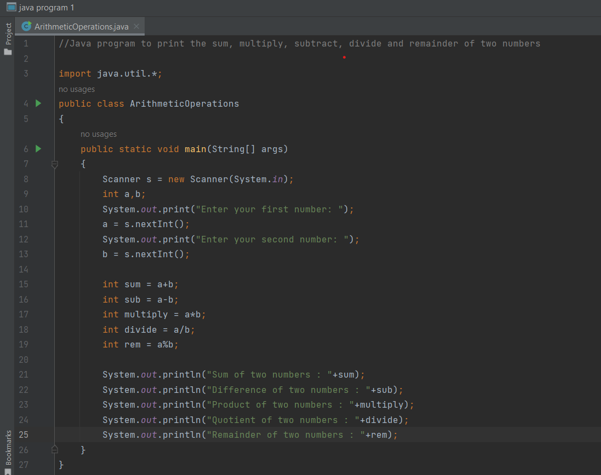
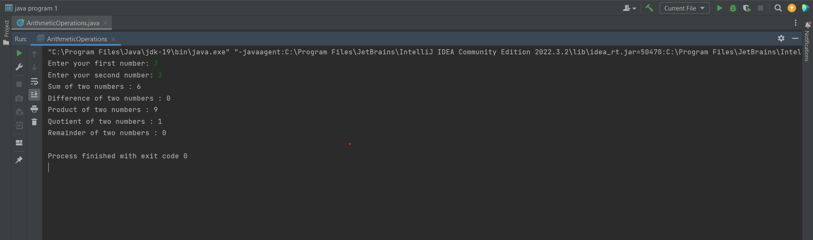
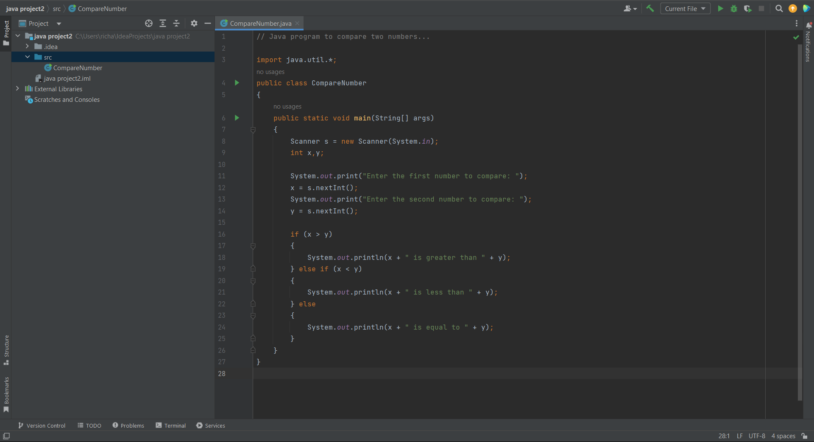
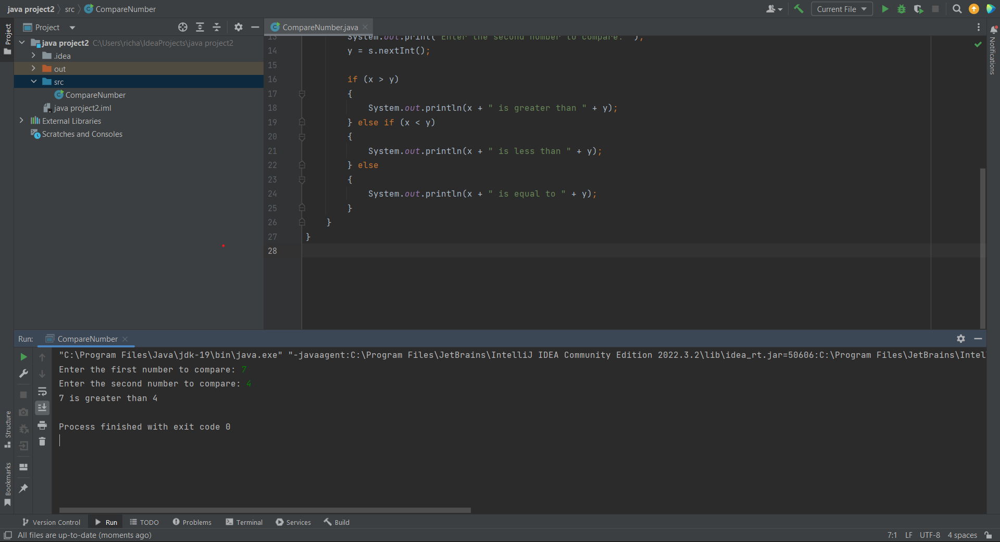
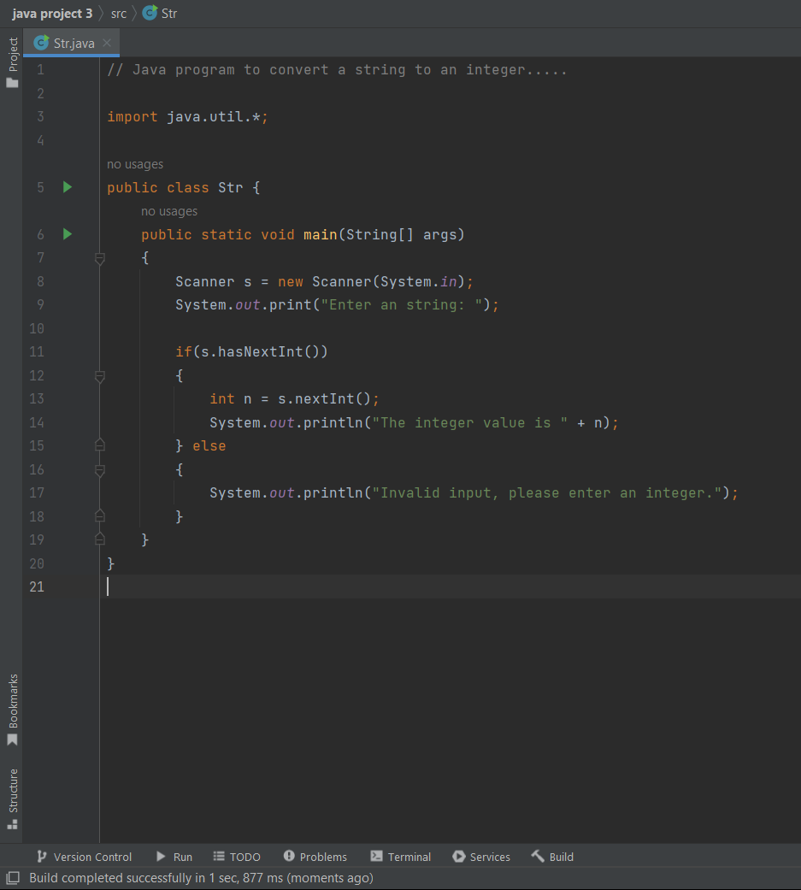
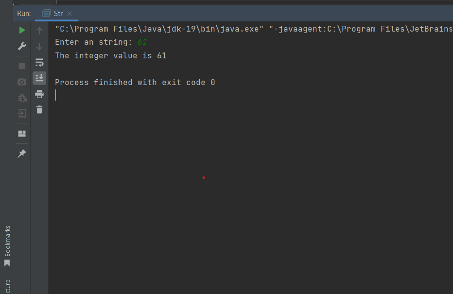

# Basic-Java-Programs...

### #1. Java program to print the sum, multiply, subtract, divide and remainder of two numbers:

```
//Java program to print the sum, multiply, subtract, divide and remainder of two numbers

import java.util.*;
public class ArithmeticOperations
{
    public static void main(String[] args)
    {
        Scanner s = new Scanner(System.in);
        int a,b;
        System.out.print("Enter your first number: ");
        a = s.nextInt();
        System.out.print("Enter your second number: ");
        b = s.nextInt();

        int sum = a+b;
        int sub = a-b;
        int multiply = a*b;
        int divide = a/b;
        int rem = a%b;

        System.out.println("Sum of two numbers : "+sum);
        System.out.println("Difference of two numbers : "+sub);
        System.out.println("Product of two numbers : "+multiply);
        System.out.println("Quotient of two numbers : "+divide);
        System.out.println("Remainder of two numbers : "+rem);
    }
}

```

### Program and Output screenshots:






### #2. Java program to compare two numbers:

```
// Java program to compare two numbers...

import java.util.*;
public class CompareNumber
{
    public static void main(String[] args)
    {
        Scanner s = new Scanner(System.in);
        int x,y;

        System.out.print("Enter the first number to compare: ");
        x = s.nextInt();
        System.out.print("Enter the second number to compare: ");
        y = s.nextInt();

        if (x > y)
        {
            System.out.println(x + " is greater than " + y);
        } else if (x < y)
        {
            System.out.println(x + " is less than " + y);
        } else
        {
            System.out.println(x + " is equal to " + y);
        }
    }
}

```

### Program and Output screenshots:






### #3. Java program to convert a string to an integer:

```
// Java program to convert a string to an integer.....

import java.util.*;

public class Str {
    public static void main(String[] args)
    {
        Scanner s = new Scanner(System.in);
        System.out.print("Enter an string: ");

        if(s.hasNextInt())
        {
            int n = s.nextInt();
            System.out.println("The integer value is " + n);
        } else
        {
            System.out.println("Invalid input, please enter an integer.");
        }
    }
}

```

### Program and Output screenshots:





