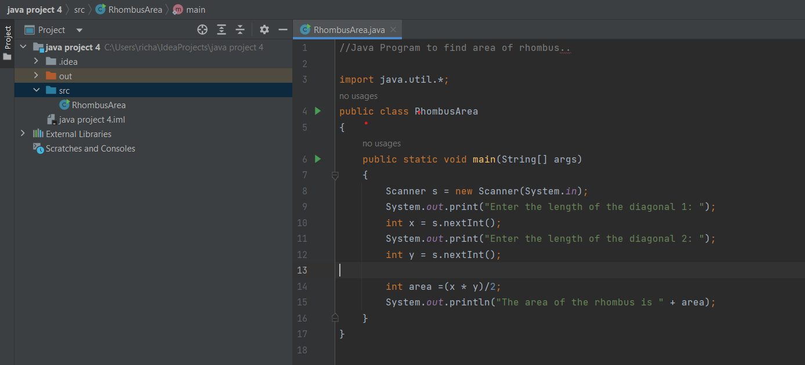

# Basic-Java-Programs...

### #1. Java program to print the sum, multiply, subtract, divide and remainder of two numbers:

```java
//Java program to print the sum, multiply, subtract, divide and remainder of two numbers....

import java.util.*;
public class ArithmeticOperations
{
    public static void main(String[] args)
    {
        Scanner s = new Scanner(System.in);
        int a,b;
        System.out.print("Enter your first number: ");
        a = s.nextInt();
        System.out.print("Enter your second number: ");
        b = s.nextInt();

        int sum = a+b;
        int sub = a-b;
        int multiply = a*b;
        int divide = a/b;
        int rem = a%b;

        System.out.println("Sum of two numbers : "+sum);
        System.out.println("Difference of two numbers : "+sub);
        System.out.println("Product of two numbers : "+multiply);
        System.out.println("Quotient of two numbers : "+divide);
        System.out.println("Remainder of two numbers : "+rem);
    }
}

```

### Program screenshot:


### Output screenshot:


### #2. Java program to compare two numbers:

```java
// Java program to compare two numbers...

import java.util.*;
public class CompareNumber
{
    public static void main(String[] args)
    {
        Scanner s = new Scanner(System.in);
        int x,y;

        System.out.print("Enter the first number to compare: ");
        x = s.nextInt();
        System.out.print("Enter the second number to compare: ");
        y = s.nextInt();

        if (x > y)
        {
            System.out.println(x + " is greater than " + y);
        } else if (x < y)
        {
            System.out.println(x + " is less than " + y);
        } else
        {
            System.out.println(x + " is equal to " + y);
        }
    }
}

```

### Program screenshot:


### Output screenshot:


### #3. Java program to convert a string to an integer:

```java
// Java program to convert a string to an integer.....

import java.util.*;

public class Str {
    public static void main(String[] args)
    {
        Scanner s = new Scanner(System.in);
        System.out.print("Enter an string: ");

        if(s.hasNextInt())
        {
            int n = s.nextInt();
            System.out.println("The integer value is " + n);
        } else
        {
            System.out.println("Invalid input, please enter an integer.");
        }
    }
}

```

### Program screenshot:


### Output screenshot:


### #4. Java Program to find area of rhombus:

```java
//Java Program to find area of rhombus..

import java.util.*;
public class RhombusArea
{
    public static void main(String[] args)
    {
        Scanner s = new Scanner(System.in);
        System.out.print("Enter the length of the diagonal 1: ");
        int x = s.nextInt();
        System.out.print("Enter the length of the diagonal 2: ");
        int y = s.nextInt();

        int area =(x * y)/2;
        System.out.println("The area of the rhombus is " + area);
    }
}

```

### Program screenshot:



### Output screenshot:


### #5. Java program to find the number of days in a month:

```java
// Java program to find the number of days in a month...

import java.util.*;
public class MonthDays {
    public static void main(String[] args) {
        Scanner s = new Scanner(System.in);
        System.out.print("Enter a month from (1-12): ");
        int month = s.nextInt();

        switch (month) {
            case 1:
                System.out.println("January has 31 days");
                break;
            case 2:
                System.out.print("Enter a year: ");
                int year = s.nextInt();
                int days;
                if ((year % 4 == 0 && year % 100 != 0) || year % 400 == 0) {
                    days = 29;
                } else {
                    days = 28;
                }
                System.out.println("February has " + days + " days");
                break;
            case 3:
                System.out.println("March has 31 days");
                break;
            case 4:
                System.out.println("April has 30 days");
                break;
            case 5:
                System.out.println("May has 31 days");
                break;
            case 6:
                System.out.println("June has 30 days");
                break;
            case 7:
                System.out.println("July has 31 days");
                break;
            case 8:
                System.out.println("August has 31 days");
                break;
            case 9:
                System.out.println("September has 30 days");
                break;
            case 10:
                System.out.println("October has 31 days");
                break;
            case 11:
                System.out.println("November has 30 days");
                break;
            case 12:
                System.out.println("December has 31 days");
                break;
            default:
                System.out.println("Invalid input, a year has only 12 months!!!");
                break;
        }
    }
}

```

### Program screenshot:


### Output screenshot:


### #6. Java program to print the even numbers from 1 to 20:

```java
// Java program to print the even numbers from 1 to 20....

public class EvenNumbers
{
    public static void main(String[] args)
    {
        for (int i = 1; i <= 20; i++)
        {
            if(i%2==0)
            {
                System.out.print(i+"\t");
            }
        }
    }
}

```

### Program screenshot:


### Output screenshot:


### #7. Java program to create a simple calculator:

```java
// Java program to create a simple calculator...

import java.util.Scanner;
public class Calculator {
    public static void main(String[] args) {
        Scanner s = new Scanner(System.in);
        System.out.print("Enter the first number: ");
        int num1 = s.nextInt();
        System.out.print("Enter the second number: ");
        int num2 = s.nextInt();
        System.out.print("Enter an operator to perform 1.Addition, 2.Subtraction, 3.Multiplication, 4.Division: ");
        int option = s.nextInt();
        int result;
        switch(option){
            case 1:
                result = num1 + num2;
                System.out.println("Addition of the two numbers is : " + result);
                break;
            case 2:
                result = num1 - num2;
                System.out.println("Subtraction of the two numbers is : " + result);
                break;
            case 3:
                result = num1 * num2;
                System.out.println("Multiplication of the two numbers is : " + result);
                break;
            case 4:
                result = num1 / num2;
                System.out.println("Division of the two numbers is : " + result);
                break;
            default:
                System.out.println("Invalid operator");
        }
    }
}


```

### Program screenshot:


### Output screenshot:


### #8. Java program to print multiplication table of given number:

```java
// Java program to print multiplication table of given number...

import java.util.Scanner;
public class MultiplicationTable
{
    public static void main(String[] args)
    {
        Scanner s = new Scanner(System.in);
        System.out.print("Enter the number to print the multiplication table : ");
        int z = s.nextInt();
        for(int i=1;i<=10;i++)
        {
            System.out.println(z+" * "+i+" = "+(z*i));
        }
    }
}

```

### Program screenshot:


### Output screenshot:


